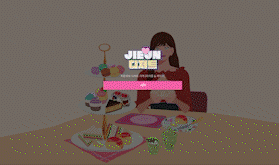

# jieun's dessert

리액트와 인터렉션을 연습하기 위해 만든 프로젝트 입니다. 
html, css, JS(Next.js, Jquery, Vanilla js)을 사용하여 구현하였으며 그 밖에 다른 라이브러리들을 사용하였습니다. 

최종적인 결과물입니다. (gif라 조금 깨져요)    
 

메인이 되는 화면입니다.    
  

첫번째 화면입니다. (버튼을 누르면 마카롱이 나옵니다.)    
  

두번째 화면입니다. (촛불을 누르면 꺼집니다.)   
  

